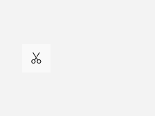
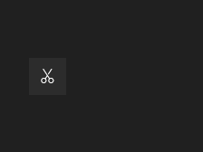

# AppBarButton

## Description

AppBarButton supplies a compact icon-and-label command inside CommandBarFlyout.

Use it for a compact action in a command bar flyout.

| Light | Dark |
| --- | --- |
|  |  |

## Example usage

```xml
<fluence:Button Content="Commands" Click="ShowFlyoutButton_Click">
    <fluence:FlyoutBase.AttachedFlyout>
        <fluence:CommandBarFlyout>
            <fluence:CommandBarFlyout.PrimaryCommands>
                <fluence:AppBarButton Label="Copy" Command="{Binding CopyCommand}" />
            </fluence:CommandBarFlyout.PrimaryCommands>
        </fluence:CommandBarFlyout>
    </fluence:FlyoutBase.AttachedFlyout>
</fluence:Button>
```

In the window or page code-behind:

```csharp
private void ShowFlyoutButton_Click(object sender, System.Windows.RoutedEventArgs e)
{
    if (sender is System.Windows.FrameworkElement target)
    {
        Fluence.Wpf.Controls.FlyoutBase.ShowAttachedFlyout(target);
    }
}
```

Bind `CopyCommand` on the page's data context.

## State and behavior

The command displays an icon and label in a command bar flyout; invoking it dismisses the flyout.

## Reference

- [C# API reference](../api/Fluence.Wpf.Controls/AppBarButton.md)
- [Gallery XAML source](../../Fluence.Wpf.Demo/Pages/GalleryMenusPage.xaml)
- [Gallery C# source](../../Fluence.Wpf.Demo/Pages/GalleryMenusPage.xaml.cs)
- [Control source](../../Fluence.Wpf/Controls/AppBarButton.cs)
- [Control catalog](../controls.md)
