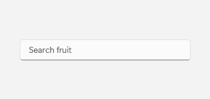
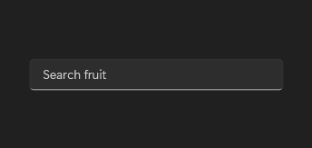

# AutoSuggestBox

## Description

Use AutoSuggestBox for search and autocomplete: handle TextChanged to filter suggestions and QuerySubmitted to act on the choice.

| Light | Dark |
| --- | --- |
|  |  |

## Example usage

```xml
<fluence:AutoSuggestBox PlaceholderText="Search" ItemsSource="{Binding Suggestions}" />
```

## State and behavior

Handle `TextChanged` to filter `ItemsSource`; the control does not filter the collection automatically. Handle `QuerySubmitted` when the user submits text or chooses a suggestion.

## Reference

- [C# API reference](../api/Fluence.Wpf.Controls/AutoSuggestBox.md)
- [Gallery XAML source](../../Fluence.Wpf.Demo/Pages/GalleryInputsPage.xaml)
- [Gallery C# source](../../Fluence.Wpf.Demo/Pages/GalleryInputsPage.xaml.cs)
- [Control source](../../Fluence.Wpf/Controls/AutoSuggestBox.cs)
- [Control catalog](../controls.md)
