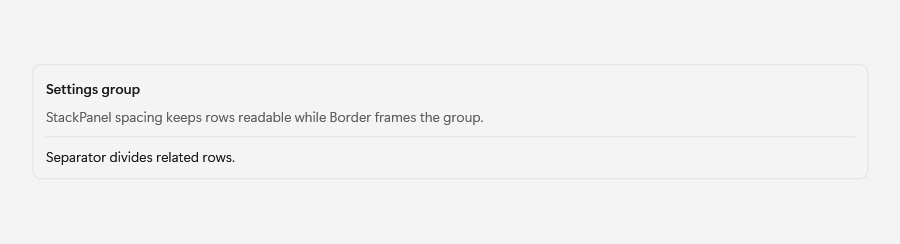
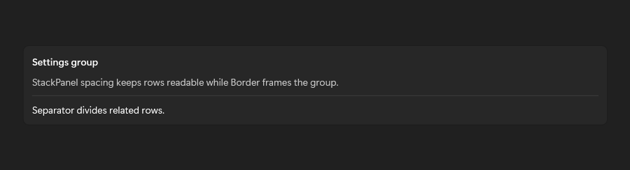

# Border

## Description

Use Border to frame a region, StackPanel spacing for readable rows, and Separator to divide related content.

| Light | Dark |
| --- | --- |
|  |  |

## Example usage

```xml
<fluence:Border
    BorderBrush="{DynamicResource CardStrokeColorDefaultBrush}"
    BorderThickness="1"
    CornerRadius="8"
    Padding="12">
    <TextBlock Text="Framed content" />
</fluence:Border>
```

## State and behavior

BorderBrush, thickness, and corner radius frame content and follow dynamic theme resources.

## Reference

- [C# API reference](../api/Fluence.Wpf.Controls/Border.md)
- [Gallery XAML source](../../Fluence.Wpf.Demo/Pages/GalleryLayoutPage.xaml)
- [Gallery C# source](../../Fluence.Wpf.Demo/Pages/GalleryLayoutPage.xaml.cs)
- [Control source](../../Fluence.Wpf/Controls/Border.cs)
- [Control catalog](../controls.md)
