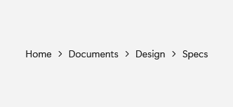
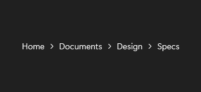

# BreadcrumbBar

## Description

Use BreadcrumbBar to show the path to the current location and jump back to any ancestor.

| Light | Dark |
| --- | --- |
|  |  |

## Example usage

```xml
<fluence:BreadcrumbBar ItemsSource="{Binding PathSegments}" />
```

## State and behavior

The current path is displayed as clickable ancestors; ItemClicked identifies a navigation target.

## Reference

- [C# API reference](../api/Fluence.Wpf.Controls/BreadcrumbBar.md)
- [Gallery XAML source](../../Fluence.Wpf.Demo/Pages/GalleryNavigationPage.xaml)
- [Gallery C# source](../../Fluence.Wpf.Demo/Pages/GalleryNavigationPage.xaml.cs)
- [Control source](../../Fluence.Wpf/Controls/BreadcrumbBar.cs)
- [Control catalog](../controls.md)
