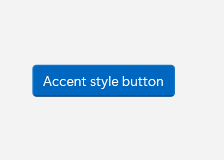
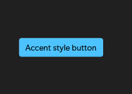
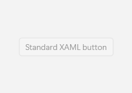
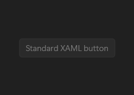
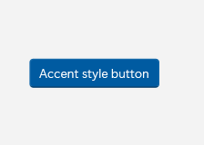
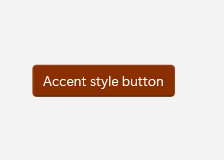

# Button

## Description

Use Button for actions. Choose its Accent appearance for the primary action and Subtle for a less prominent command.

| Light | Dark |
| --- | --- |
|  |  |

### Captured state changes

**Disabled**




**Blue accent**



**Orange accent**



## Example usage

```xml
<fluence:Button Content="Accent style button" Appearance="Accent" />
```

## State and behavior

Appearance changes emphasis. Pointer-over, pressed, keyboard focus, and disabled states change the surface.

## Reference

- [C# API reference](../api/Fluence.Wpf.Controls/Button.md)
- [Gallery XAML source](../../Fluence.Wpf.Demo/Pages/GalleryButtonsPage.xaml)
- [Gallery C# source](../../Fluence.Wpf.Demo/Pages/GalleryButtonsPage.xaml.cs)
- [Control source](../../Fluence.Wpf/Controls/Button.cs)
- [Control catalog](../controls.md)
