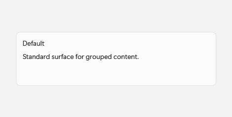
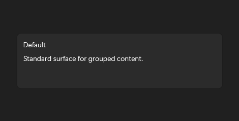

# Card

## Description

Use Card variants to group related data with different levels of visual emphasis.

| Light | Dark |
| --- | --- |
|  |  |

## Example usage

```xml
<fluence:Card Header="Account" Content="Profile details" IsClickable="True" />
```

## State and behavior

Cards may be passive or clickable; clickable cards expose pointer, focus, and pressed states.

## Reference

- [C# API reference](../api/Fluence.Wpf.Controls/Card.md)
- [Gallery XAML source](../../Fluence.Wpf.Demo/Pages/GalleryDataPage.xaml)
- [Gallery C# source](../../Fluence.Wpf.Demo/Pages/GalleryDataPage.xaml.cs)
- [Control source](../../Fluence.Wpf/Controls/Card.cs)
- [Control catalog](../controls.md)
