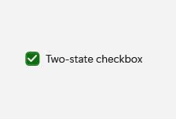
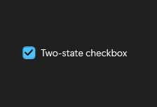

# CheckBox

## Description

Use check boxes for independent options. Add three-state only when an indeterminate value has meaning.

| Light | Dark |
| --- | --- |
|  |  |

## Example usage

```xml
<fluence:CheckBox Content="Two-state checkbox" IsChecked="True" />
```

## State and behavior

IsChecked shows unchecked and checked states, with indeterminate available when IsThreeState is enabled.

In High Contrast, the indeterminate plate and dash use their own normal, hover, pressed, and disabled resources, distinct from the checked mark. The [theme resource guide](../theming.md#high-contrast-roles) lists the published keys and their Windows color roles.

## Reference

- [C# API reference](../api/Fluence.Wpf.Controls/CheckBox.md)
- [Gallery XAML source](../../Fluence.Wpf.Demo/Pages/GallerySelectionPage.xaml)
- [Gallery C# source](../../Fluence.Wpf.Demo/Pages/GallerySelectionPage.xaml.cs)
- [Control source](../../Fluence.Wpf/Controls/CheckBox.cs)
- [Control catalog](../controls.md)
