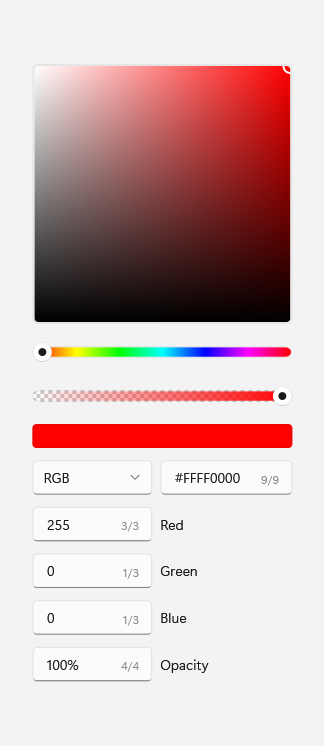
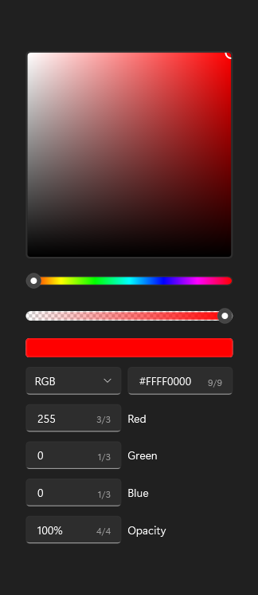

# ColorPicker

## Description

Use ColorPicker for choosing a color from a saturation/value spectrum with a hue slider, alpha, RGB/HSV channel text input, and hex input.

| Light | Dark |
| --- | --- |
|  |  |

## Example usage

```xml
<fluence:ColorPicker Color="Red" />
```

## State and behavior

Spectrum, hue, alpha, channel, and hex input update Color and raise ColorChanged.

## Reference

- [C# API reference](../api/Fluence.Wpf.Controls/ColorPicker.md)
- [Gallery XAML source](../../Fluence.Wpf.Demo/Pages/GalleryFormsPage.xaml)
- [Gallery C# source](../../Fluence.Wpf.Demo/Pages/GalleryFormsPage.xaml.cs)
- [Control source](../../Fluence.Wpf/Controls/ColorPicker.cs)
- [Control catalog](../controls.md)
