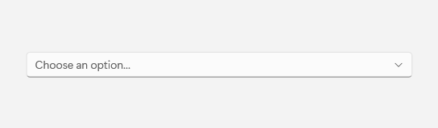
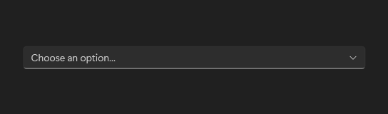

# ComboBox

## Description

Use a combo box when the choices are useful but do not need to stay visible.

| Light | Dark |
| --- | --- |
|  |  |

## Example usage

```xml
<fluence:ComboBox PlaceholderText="Choose an option..." SelectedIndex="-1">
    <ComboBoxItem Content="First item" />
    <ComboBoxItem Content="Second item" />
</fluence:ComboBox>
```

## State and behavior

Opening the list reveals choices; selection updates SelectedItem and the collapsed label.

## Reference

- [C# API reference](../api/Fluence.Wpf.Controls/ComboBox.md)
- [Gallery XAML source](../../Fluence.Wpf.Demo/Pages/GallerySelectionPage.xaml)
- [Gallery C# source](../../Fluence.Wpf.Demo/Pages/GallerySelectionPage.xaml.cs)
- [Control source](../../Fluence.Wpf/Controls/ComboBox.cs)
- [Control catalog](../controls.md)
