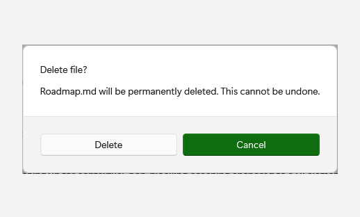
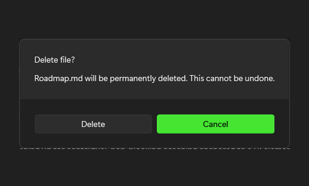

# ContentDialog

## Description

Use ContentDialog for modal prompts that require an explicit choice (confirmations, errors, sign-in).

The images show the dialog while it is open. A closed dialog has no visible surface.

| Light | Dark |
| --- | --- |
|  |  |

## Example usage

```csharp
Fluence.Wpf.Controls.ContentDialog dialog = new()
{
    Title = "Delete file?",
    Content = "Roadmap.md will be permanently deleted.",
    PrimaryButtonText = "Delete",
    CloseButtonText = "Cancel",
};
Fluence.Wpf.ContentDialogResult result = await dialog.ShowAsync();
```

Call `ShowAsync` on the UI dispatcher while an owner window is active.

## State and behavior

ShowAsync presents a modal choice; button actions complete it with a result.

## Reference

- [C# API reference](../api/Fluence.Wpf.Controls/ContentDialog.md)
- [Gallery XAML source](../../Fluence.Wpf.Demo/Pages/GalleryMenusPage.xaml)
- [Gallery C# source](../../Fluence.Wpf.Demo/Pages/GalleryMenusPage.xaml.cs)
- [Control source](../../Fluence.Wpf/Controls/ContentDialog.cs)
- [Control catalog](../controls.md)
