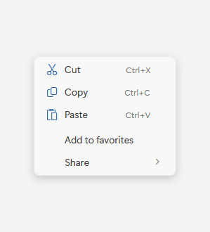
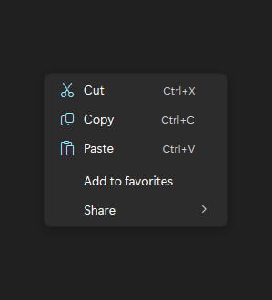

# ContextMenu

## Description

Use ContextMenu for actions that apply to a selected item or region.

| Light | Dark |
| --- | --- |
|  |  |

### Captured state changes

**Open**




## Example usage

```xml
<fluence:Button Content="Open context menu">
    <fluence:Button.ContextMenu>
        <fluence:ContextMenu>
            <fluence:MenuItem Header="Copy" />
        </fluence:ContextMenu>
    </fluence:Button.ContextMenu>
</fluence:Button>
```

## State and behavior

The menu opens at the target and closes after a command or light dismissal.

## Reference

- [C# API reference](../api/Fluence.Wpf.Controls/ContextMenu.md)
- [Gallery XAML source](../../Fluence.Wpf.Demo/Pages/GalleryMenusPage.xaml)
- [Gallery C# source](../../Fluence.Wpf.Demo/Pages/GalleryMenusPage.xaml.cs)
- [Control source](../../Fluence.Wpf/Controls/ContextMenu.cs)
- [Control catalog](../controls.md)
