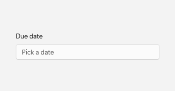
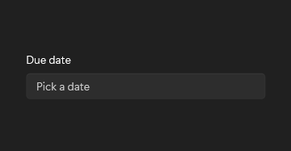

# DatePicker

## Description

Use DatePicker for choosing a date from day, month, and year columns in a flyout.

| Light | Dark |
| --- | --- |
|  |  |

## Example usage

```xml
<fluence:DatePicker Header="Due date" PlaceholderText="Pick a date" />
```

## State and behavior

Opening the picker exposes day, month, and year columns; selection updates SelectedDate.

## Reference

- [C# API reference](../api/Fluence.Wpf.Controls/DatePicker.md)
- [Gallery XAML source](../../Fluence.Wpf.Demo/Pages/GalleryFormsPage.xaml)
- [Gallery C# source](../../Fluence.Wpf.Demo/Pages/GalleryFormsPage.xaml.cs)
- [Control source](../../Fluence.Wpf/Controls/DatePicker.cs)
- [Control catalog](../controls.md)
