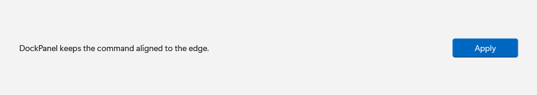
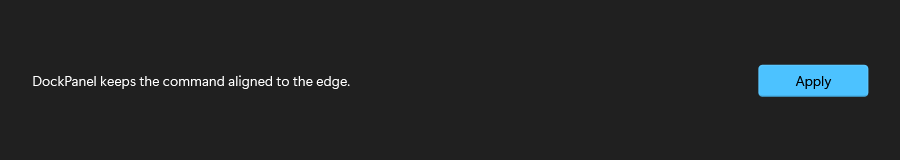

# DockPanel

## Description

Use DockPanel when one element should pin to an edge while the remaining content fills the available space.

| Light | Dark |
| --- | --- |
|  |  |

## Example usage

```xml
<fluence:DockPanel>
    <fluence:Button DockPanel.Dock="Right" Content="Action" />
    <TextBlock Text="Summary" />
</fluence:DockPanel>
```

## State and behavior

Dock attached properties pin children to edges while the final child fills remaining space.

## Reference

- [C# API reference](../api/Fluence.Wpf.Controls/DockPanel.md)
- [Gallery XAML source](../../Fluence.Wpf.Demo/Pages/GalleryLayoutPage.xaml)
- [Gallery C# source](../../Fluence.Wpf.Demo/Pages/GalleryLayoutPage.xaml.cs)
- [Control source](../../Fluence.Wpf/Controls/DockPanel.cs)
- [Control catalog](../controls.md)
