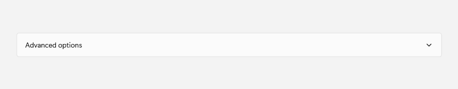
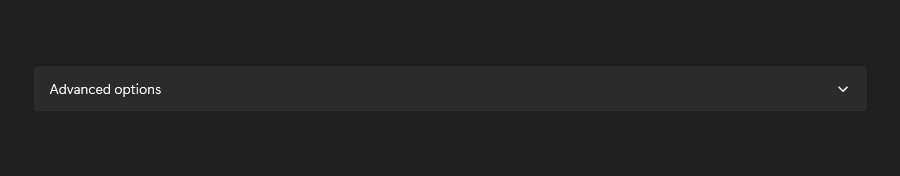
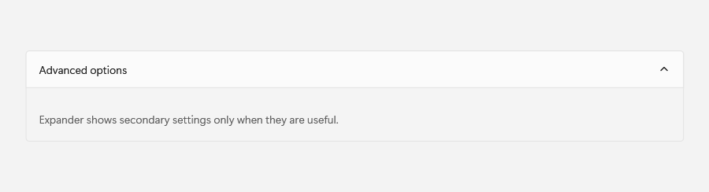
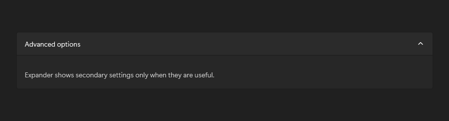

# Expander

## Description

Use Expander for secondary settings that should start collapsed until needed.

| Light | Dark |
| --- | --- |
|  |  |

### Captured state changes

**Expanded**




## Example usage

```xml
<fluence:Expander Header="Advanced options" IsExpanded="False">
    <fluence:ToggleSwitch HeaderContent="Send notifications" />
</fluence:Expander>
```

## State and behavior

IsExpanded reveals or hides secondary content; the header remains visible.

## Reference

- [C# API reference](../api/Fluence.Wpf.Controls/Expander.md)
- [Gallery XAML source](../../Fluence.Wpf.Demo/Pages/GalleryLayoutPage.xaml)
- [Gallery C# source](../../Fluence.Wpf.Demo/Pages/GalleryLayoutPage.xaml.cs)
- [Control source](../../Fluence.Wpf/Controls/Expander.cs)
- [Control catalog](../controls.md)
