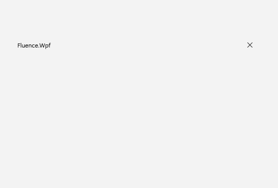
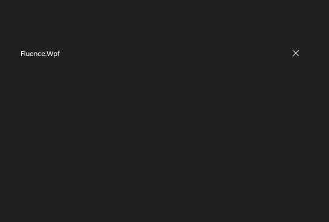

# FluenceWindow

## Description

`FluenceWindow` derives from WPF `Window`. It provides custom DWM window chrome, optional content in the title bar, caption button controls, and Fluence theme integration. Its properties below extend the normal WPF window API. For a complete window example, see [Basic walkthrough](../csharp/usage.md).

Use it as the main window when an app needs Fluence chrome, a custom title bar, or a system backdrop.

| Light | Dark |
| --- | --- |
|  |  |

## Example usage

Initialize the theme before creating or showing a window. Remove `StartupUri` from `App.xaml` when creating the window in `OnStartup`, as described in [Basic walkthrough](../csharp/usage.md#initialize-the-application). `SystemBackdropType` is a per-window request. The default is `Auto`; the operating system and current theme determine the available effect.

```xml
<fluence:FluenceWindow x:Class="MyApp.MainWindow"
    xmlns="http://schemas.microsoft.com/winfx/2006/xaml/presentation"
    xmlns:x="http://schemas.microsoft.com/winfx/2006/xaml"
    xmlns:fluence="http://schemas.fluencewpf.com"
    Title="My app"
    Width="900"
    Height="640"
    SystemBackdropType="Auto"
    CornerStyle="Round">
    <Grid />
</fluence:FluenceWindow>
```
```csharp
using System.Windows;
using Fluence.Wpf;
using Fluence.Wpf.Controls;

namespace MyApp;

public partial class MainWindow : FluenceWindow
{
    public MainWindow()
    {
        InitializeComponent();
    }
}

public partial class App : Application
{
    protected override void OnStartup(StartupEventArgs e)
    {
        ApplicationThemeManager.Apply(ApplicationTheme.Light);
        base.OnStartup(e);

        MainWindow mainWindow = new();
        mainWindow.Show();
    }
}
```

The `FluenceWindow` dependency properties add to, rather than replace, inherited `Window` properties such as `Title`, `Width`, `Height`, `ResizeMode`, `WindowStartupLocation`, `Owner`, and `Content`.

## State and behavior

### FluenceWindow properties
| Property | Default | Purpose |
| --- | --- | --- |
| `SystemBackdropType` | `WindowBackdropType.Auto` | Requests `Auto`, `Mica`, `Acrylic`, `Tabbed`, or `None` for this window. |
| `CornerStyle` | `WindowCornerPreference.Round` | Requests `Default`, `DoNotRound`, `Round`, or `RoundSmall` corners. Windows may ignore unsupported requests. |
| `ExtendsContentIntoTitleBar` | `false` | Extends the client area into the title bar region. Set true when supplying a custom title bar. |
| `TitleBar` | `null` | Optional `UIElement` used as custom title-bar content. `SetTitleBar(UIElement?)` is also available. |
| `TitleBarHeight` | `48` device-independent units | Height of the title-bar hit-test region. |
| `ShowIcon`, `ShowTitle` | `true` | Controls the standard icon and title display. |
| `IsMinimizeButtonVisible`, `IsMaximizeButtonVisible`, `IsCloseButtonVisible` | `Visibility.Visible` | Overrides visibility for the corresponding caption control. |
| `IsMinimizable`, `IsMaximizable`, `IsClosable` | `true` | Enables or disables the corresponding caption action. |
| `IsMoveable` | `true` | Allows dragging the window from noninteractive title-bar space. |
| `HasShadow` | `true` | Requests the window shadow. |
| `MarginMaximized` | `Thickness(0)` | Maximized frame margin used by the custom chrome implementation. Normally leave the system-calculated value alone. |

The visibility and capability properties serve different purposes: visibility controls whether a caption button is shown, while the `Is*able` properties control whether the action is permitted. `ResizeMode` remains a WPF constraint and can also limit minimize/maximize behavior.

### Backdrops and platform behavior

`ApplicationThemeManager.Apply(theme, backdrop)` records an application-level backdrop request and raises the manager change event when appropriate. `FluenceWindow` does not read `CurrentBackdrop` as a global default: choose the requested effect on each window with `SystemBackdropType`.

Mica, Acrylic, Tabbed, and rounded-corner requests depend on Windows capabilities. Windows 11 uses DWM system backdrop support where available. On Windows 10, the library uses its documented fallback; high contrast uses an opaque surface. The OS can ignore unsupported corner requests. See the [compatibility guide](../reference/compatibility.md).

`FluenceWindow` begins watching relevant system theme changes when its native window is initialized and updates its chrome accordingly. Call `ApplicationThemeManager.Apply` before showing windows so Fluence resources are ready.

## Reference

- [C# API reference](../api/Fluence.Wpf.Controls/FluenceWindow.md)
- [Gallery XAML source](../../Fluence.Wpf.Demo/MainWindow.xaml)
- [Gallery C# source](../../Fluence.Wpf.Demo/MainWindow.xaml.cs)
- [Control source](../../Fluence.Wpf/Controls/FluenceWindow.cs)
- [Control catalog](../controls.md)
