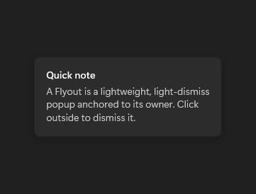

# FlyoutBase

## Description

FlyoutBase defines the attached and programmatic flyout APIs used by concrete flyouts. `FlyoutBase` is shown within `Flyout`; it is not a separate gallery destination.

Use its attached flyout API when a control needs a concrete Flyout or CommandBarFlyout.

The images show an open Flyout, a concrete implementation of FlyoutBase.

| Light | Dark |
| --- | --- |
|  |  |

## Example usage

```xml
<fluence:Button Content="More" Click="ShowFlyoutButton_Click">
    <fluence:FlyoutBase.AttachedFlyout>
        <fluence:Flyout Content="Details" />
    </fluence:FlyoutBase.AttachedFlyout>
</fluence:Button>
```

In the window or page code-behind:

```csharp
private void ShowFlyoutButton_Click(object sender, System.Windows.RoutedEventArgs e)
{
    if (sender is System.Windows.FrameworkElement target)
    {
        Fluence.Wpf.Controls.FlyoutBase.ShowAttachedFlyout(target);
    }
}
```

## State and behavior

FlyoutBase is abstract; attach a concrete Flyout or CommandBarFlyout and use ShowAt or Hide.

## Reference

- [C# API reference](../api/Fluence.Wpf.Controls/FlyoutBase.md)
- [Gallery XAML source](../../Fluence.Wpf.Demo/Pages/GalleryMenusPage.xaml)
- [Gallery C# source](../../Fluence.Wpf.Demo/Pages/GalleryMenusPage.xaml.cs)
- [Control source](../../Fluence.Wpf/Controls/FlyoutBase.cs)
- [Control catalog](../controls.md)
