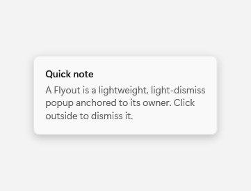

# FlyoutPresenter

## Description

FlyoutPresenter draws the popup surface for Flyout content. `FlyoutPresenter` is shown within `Flyout`; it is not a separate gallery destination.

Use it through Flyout when popup content needs the standard presentation surface.

The images show the presenter while its flyout is open.

| Light | Dark |
| --- | --- |
|  |  |

## Example usage

```xml
<fluence:Button Content="More" Click="ShowFlyoutButton_Click">
    <fluence:FlyoutBase.AttachedFlyout>
        <fluence:Flyout Content="Details" />
    </fluence:FlyoutBase.AttachedFlyout>
</fluence:Button>
```

In the window or page code-behind:

```csharp
private void ShowFlyoutButton_Click(object sender, System.Windows.RoutedEventArgs e)
{
    if (sender is System.Windows.FrameworkElement target)
    {
        Fluence.Wpf.Controls.FlyoutBase.ShowAttachedFlyout(target);
    }
}
```

## State and behavior

The presenter is the visual surface created for Flyout content; its appearance follows the theme.

## Reference

- [C# API reference](../api/Fluence.Wpf.Controls/FlyoutPresenter.md)
- [Gallery XAML source](../../Fluence.Wpf.Demo/Pages/GalleryMenusPage.xaml)
- [Gallery C# source](../../Fluence.Wpf.Demo/Pages/GalleryMenusPage.xaml.cs)
- [Control source](../../Fluence.Wpf/Controls/FlyoutPresenter.cs)
- [Control catalog](../controls.md)
