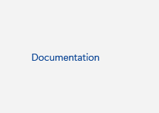
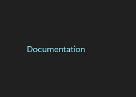

# HyperlinkButton

## Description

Use HyperlinkButton for lightweight navigation and related secondary actions.

| Light | Dark |
| --- | --- |
|  |  |

## Example usage

```xml
<fluence:HyperlinkButton
    Content="Documentation"
    NavigateUri="https://github.com/sintaxasn/Fluence.Wpf" />
```

## State and behavior

The link responds to pointer and keyboard input; disabled links do not activate.

## Reference

- [C# API reference](../api/Fluence.Wpf.Controls/HyperlinkButton.md)
- [Gallery XAML source](../../Fluence.Wpf.Demo/Pages/GalleryButtonsPage.xaml)
- [Gallery C# source](../../Fluence.Wpf.Demo/Pages/GalleryButtonsPage.xaml.cs)
- [Control source](../../Fluence.Wpf/Controls/HyperlinkButton.cs)
- [Control catalog](../controls.md)
