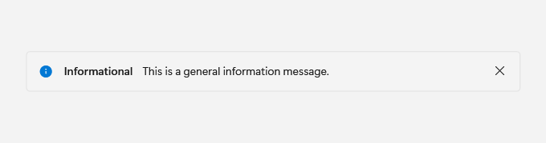

# InfoBar

## Description

Use InfoBar for inline messages that explain status, validation, or recoverable outcomes.

| Light | Dark |
| --- | --- |
|  |  |

### Captured state changes

**Dismissed**


## Example usage

```xml
<fluence:InfoBar
    Title="Saved"
    Content="Your changes are ready."
    Severity="Success"
    IsOpen="True" />
```

## State and behavior

IsOpen shows or dismisses the message; Severity changes the visual treatment.

## Reference

- [C# API reference](../api/Fluence.Wpf.Controls/InfoBar.md)
- [Gallery XAML source](../../Fluence.Wpf.Demo/Pages/GalleryStatusPage.xaml)
- [Gallery C# source](../../Fluence.Wpf.Demo/Pages/GalleryStatusPage.xaml.cs)
- [Control source](../../Fluence.Wpf/Controls/InfoBar.cs)
- [Control catalog](../controls.md)
