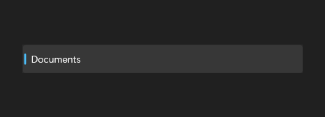

# ListBoxItem

## Description

ListBoxItem is the visible selectable container inside ListBox. `ListBoxItem` is shown within `ListBox`; it is not a separate gallery destination.

Use it as an item container within a ListBox.

| Light | Dark |
| --- | --- |
|  |  |

## Example usage

```xml
<fluence:ListBox>
    <fluence:ListBoxItem Content="Documents" IsSelected="True" />
    <fluence:ListBoxItem Content="Pictures" />
</fluence:ListBox>
```

## State and behavior

The item container shows selection, pointer, focus, and disabled states within ListBox.

## Reference

- [C# API reference](../api/Fluence.Wpf.Controls/ListBoxItem.md)
- [Gallery XAML source](../../Fluence.Wpf.Demo/Pages/GalleryDataPage.xaml)
- [Gallery C# source](../../Fluence.Wpf.Demo/Pages/GalleryDataPage.xaml.cs)
- [Control source](../../Fluence.Wpf/Controls/ListBoxItem.cs)
- [Control catalog](../controls.md)
