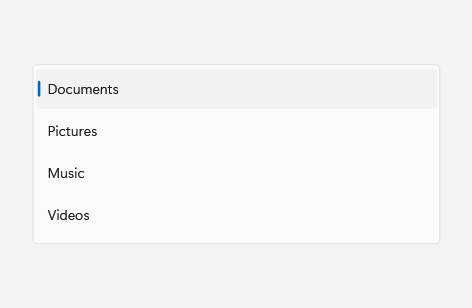
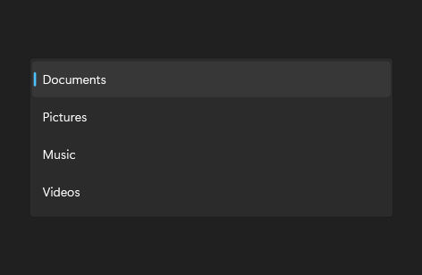

# ListBox

## Description

Use ListBox for compact selection lists; set SelectionMode to Extended to allow selecting multiple items.

| Light | Dark |
| --- | --- |
|  |  |

## Example usage

```xml
<fluence:ListBox SelectionMode="Extended">
    <fluence:ListBoxItem Content="Documents" />
    <fluence:ListBoxItem Content="Pictures" />
</fluence:ListBox>
```

## State and behavior

SelectionMode controls single or extended selection; selected items receive a distinct state.

## Reference

- [C# API reference](../api/Fluence.Wpf.Controls/ListBox.md)
- [Gallery XAML source](../../Fluence.Wpf.Demo/Pages/GalleryDataPage.xaml)
- [Gallery C# source](../../Fluence.Wpf.Demo/Pages/GalleryDataPage.xaml.cs)
- [Control source](../../Fluence.Wpf/Controls/ListBox.cs)
- [Control catalog](../controls.md)
