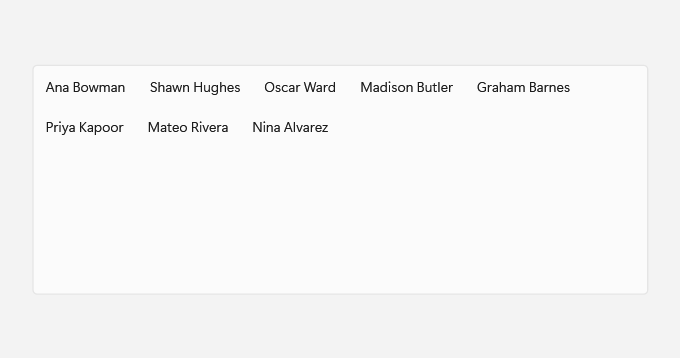
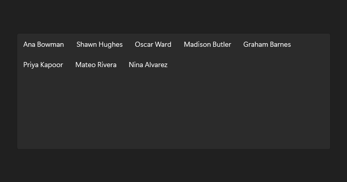

# ListView

## Description

Set ItemsLayout to Grid when items read better as tiles that wrap across the list; List keeps one item per row.

Use it for a list of items, switching to a grid when tiles suit the content.

| Light | Dark |
| --- | --- |
|  |  |

## Example usage

```xml
<fluence:ListView ItemsLayout="Grid">
    <fluence:ListView.EmptyContent>
        <TextBlock Text="No people to show." />
    </fluence:ListView.EmptyContent>
    <ListViewItem Content="Ana Bowman" />
    <ListViewItem Content="Shawn Hughes" />
    <ListViewItem Content="Priya Kapoor" />
</fluence:ListView>
```

## State and behavior

Selection highlights a row. `ItemsLayout="Grid"` arranges items as tiles; change it to `List` for one item per row. `EmptyContent` appears when the collection is empty.

## Reference

- [C# API reference](../api/Fluence.Wpf.Controls/ListView.md)
- [Gallery XAML source](../../Fluence.Wpf.Demo/Pages/GalleryDataPage.xaml)
- [Gallery C# source](../../Fluence.Wpf.Demo/Pages/GalleryDataPage.xaml.cs)
- [Control source](../../Fluence.Wpf/Controls/ListView.cs)
- [Control catalog](../controls.md)
