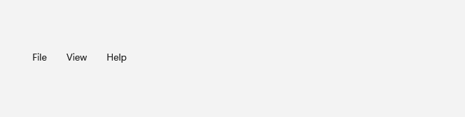

# Menu

## Description

Use Menu for persistent command groups with submenus, keyboard cues, separators, and checked states.

| Light | Dark |
| --- | --- |
|  |  |

## Example usage

```xml
<fluence:Menu>
    <fluence:MenuItem Header="_File">
        <fluence:MenuItem Header="_Open" />
    </fluence:MenuItem>
</fluence:Menu>
```

## State and behavior

Opening a menu reveals commands; checked, keyboard focus, and disabled menu items have distinct states.

## Reference

- [C# API reference](../api/Fluence.Wpf.Controls/Menu.md)
- [Gallery XAML source](../../Fluence.Wpf.Demo/Pages/GalleryMenusPage.xaml)
- [Gallery C# source](../../Fluence.Wpf.Demo/Pages/GalleryMenusPage.xaml.cs)
- [Control source](../../Fluence.Wpf/Controls/Menu.cs)
- [Control catalog](../controls.md)
