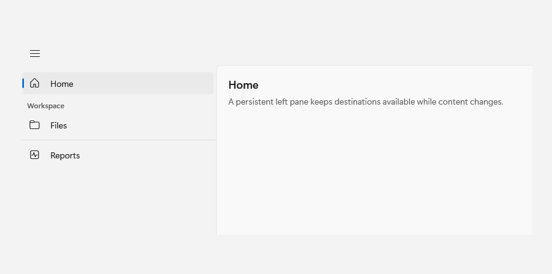
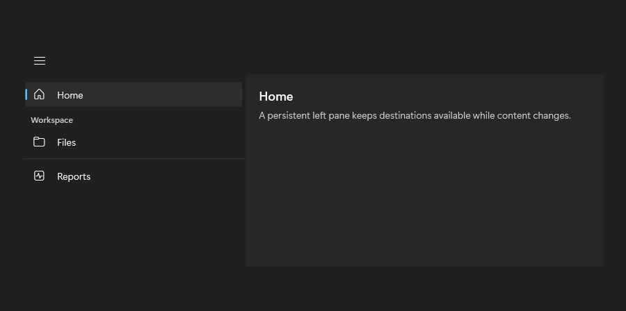

# NavigationView

## Description

Use a left pane for persistent destinations, with a header and separator to group the items.

| Light | Dark |
| --- | --- |
|  |  |

## Example usage

```xml
<fluence:NavigationView PaneDisplayMode="Left">
    <fluence:NavigationViewItem Content="Home" IsSelected="True" />
    <fluence:NavigationViewItem Content="Files" />
</fluence:NavigationView>
```

## State and behavior

Selection moves the indicator; pane display mode changes the shell layout and back requests are explicit.

## Reference

- [C# API reference](../api/Fluence.Wpf.Controls/NavigationView.md)
- [Gallery XAML source](../../Fluence.Wpf.Demo/Pages/GalleryNavigationPage.xaml)
- [Gallery C# source](../../Fluence.Wpf.Demo/Pages/GalleryNavigationPage.xaml.cs)
- [Control source](../../Fluence.Wpf/Controls/NavigationView.cs)
- [Control catalog](../controls.md)
