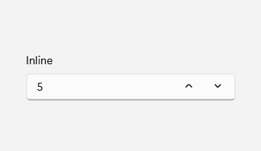
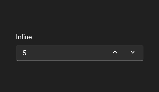

# NumberBox

## Description

Use number boxes for numeric entry with optional spin buttons, bounds, and supporting descriptions.

| Light | Dark |
| --- | --- |
|  |  |

## Example usage

```xml
<fluence:NumberBox Header="Inline" Value="5" Minimum="0" />
```

## State and behavior

Spin buttons and text entry change Value within configured bounds; invalid input can be reported.

## Reference

- [C# API reference](../api/Fluence.Wpf.Controls/NumberBox.md)
- [Gallery XAML source](../../Fluence.Wpf.Demo/Pages/GalleryInputsPage.xaml)
- [Gallery C# source](../../Fluence.Wpf.Demo/Pages/GalleryInputsPage.xaml.cs)
- [Control source](../../Fluence.Wpf/Controls/NumberBox.cs)
- [Control catalog](../controls.md)
