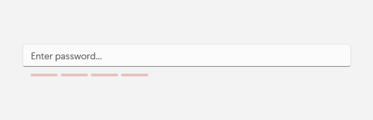
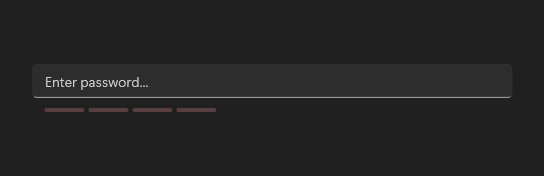

# PasswordBoxExtensions

## Description

PasswordBoxExtensions adds Fluent placeholder, reveal, and feedback properties to native PasswordBox. `PasswordBoxExtensions` is shown within `PasswordBox`; it is not a separate gallery destination.

The images show the styled PasswordBox with its placeholder.

| Light | Dark |
| --- | --- |
|  |  |

## Example usage

```xml
<PasswordBox fluence:PasswordBoxExtensions.PlaceholderText="Password"
             fluence:PasswordBoxExtensions.RevealButtonEnabled="True" />
```

## State and behavior

The attached properties add placeholder, reveal, Caps Lock, and strength feedback to native PasswordBox.

## Reference

- [C# API reference](../api/Fluence.Wpf.Controls/PasswordBoxExtensions.md)
- [Gallery XAML source](../../Fluence.Wpf.Demo/Pages/GalleryInputsPage.xaml)
- [Gallery C# source](../../Fluence.Wpf.Demo/Pages/GalleryInputsPage.xaml.cs)
- [Control source](../../Fluence.Wpf/Controls/PasswordBoxExtensions.cs)
- [Control catalog](../controls.md)
