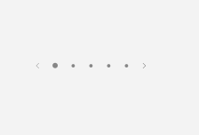
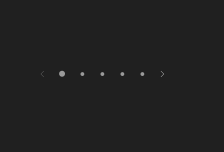
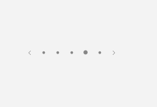

# PipsPager

## Description

Use PipsPager for compact page indication and switching, as in carousels and onboarding flows.

| Light | Dark |
| --- | --- |
|  |  |

### Captured state changes

**Page selected**




## Example usage

```xml
<fluence:PipsPager NumberOfPages="5" SelectedPageIndex="0" />
```

## State and behavior

The selected pip follows SelectedPageIndex; next and previous actions change the current page.

## Reference

- [C# API reference](../api/Fluence.Wpf.Controls/PipsPager.md)
- [Gallery XAML source](../../Fluence.Wpf.Demo/Pages/GalleryNavigationPage.xaml)
- [Gallery C# source](../../Fluence.Wpf.Demo/Pages/GalleryNavigationPage.xaml.cs)
- [Control source](../../Fluence.Wpf/Controls/PipsPager.cs)
- [Control catalog](../controls.md)
