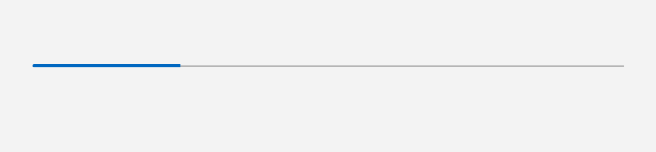
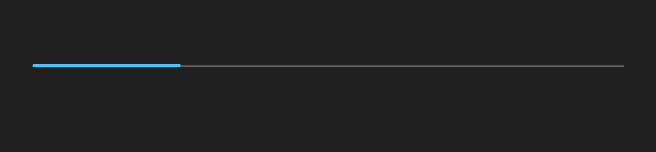

# ProgressBar

## Description

Use ProgressBar for measurable work where the current value can be reported.

| Light | Dark |
| --- | --- |
|  |  |

## Example usage

```xml
<fluence:StackPanel Spacing="12">
    <fluence:ProgressBar Minimum="0" Maximum="100" Value="45" />
    <fluence:ProgressBar IsIndeterminate="True" />
</fluence:StackPanel>
```

## State and behavior

Value fills a determinate bar; IsIndeterminate presents ongoing work without a percentage.

## Reference

- [C# API reference](../api/Fluence.Wpf.Controls/ProgressBar.md)
- [Gallery XAML source](../../Fluence.Wpf.Demo/Pages/GalleryStatusPage.xaml)
- [Gallery C# source](../../Fluence.Wpf.Demo/Pages/GalleryStatusPage.xaml.cs)
- [Control source](../../Fluence.Wpf/Controls/ProgressBar.cs)
- [Control catalog](../controls.md)
