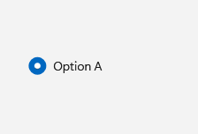

# RadioButton

## Description

Use radio buttons when people must choose exactly one option from a visible group.

| Light | Dark |
| --- | --- |
|  |  |

## Example usage

```xml
<fluence:StackPanel Spacing="8">
    <fluence:RadioButton Content="Option A" GroupName="Choice" IsChecked="True" />
    <fluence:RadioButton Content="Option B" GroupName="Choice" />
</fluence:StackPanel>
```

## State and behavior

Selecting one choice in a group clears its peer selection.

## Reference

- [C# API reference](../api/Fluence.Wpf.Controls/RadioButton.md)
- [Gallery XAML source](../../Fluence.Wpf.Demo/Pages/GallerySelectionPage.xaml)
- [Gallery C# source](../../Fluence.Wpf.Demo/Pages/GallerySelectionPage.xaml.cs)
- [Control source](../../Fluence.Wpf/Controls/RadioButton.cs)
- [Control catalog](../controls.md)
