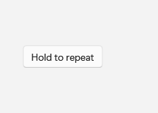
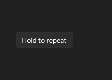

# RepeatButton

## Description

Use RepeatButton when holding the pointer should raise Click repeatedly.

| Light | Dark |
| --- | --- |
|  |  |

## Example usage

```xml
<fluence:RepeatButton Content="Hold to repeat" />
```

## State and behavior

Holding the pointer raises repeated Click events until release; disabling it stops interaction.

## Reference

- [C# API reference](../api/Fluence.Wpf.Controls/RepeatButton.md)
- [Gallery XAML source](../../Fluence.Wpf.Demo/Pages/GalleryButtonsPage.xaml)
- [Gallery C# source](../../Fluence.Wpf.Demo/Pages/GalleryButtonsPage.xaml.cs)
- [Control source](../../Fluence.Wpf/Controls/RepeatButton.cs)
- [Control catalog](../controls.md)
