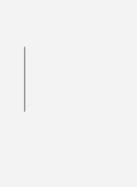
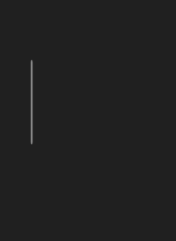
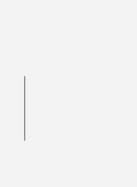

# ScrollBarExtensions

## Description

ScrollBarExtensions adds indicator behavior to native WPF ScrollBar. `ScrollBarExtensions` is shown within `SmoothScrollViewer`; it is not a separate gallery destination.

The gallery scroll viewer enables the indicator behavior through its internal scrollbar template. These images isolate its vertical scrollbar before and after scrolling, with the indicator visible.

| Light | Dark |
| --- | --- |
|  |  |

### After scrolling

| Light | Dark |
| --- | --- |
|  |  |

## Example usage

```xml
<fluence:SmoothScrollViewer Height="160">
    <StackPanel Height="500">
        <TextBlock Text="Top" />
        <TextBlock Margin="0,450,0,0" Text="Bottom" />
    </StackPanel>
</fluence:SmoothScrollViewer>
```

The Fluence scroll viewer template applies `ScrollBarExtensions.IsIndicatorEnabled` to its internal scroll bars. A custom scrollbar can set that attached property only when its template supports the Fluence indicator states. A standalone bar has no scroll viewer host and stays visible.

## State and behavior

Attached indicator settings alter the native ScrollBar's indicator presentation during interaction.

## Reference

- [C# API reference](../api/Fluence.Wpf.Controls/ScrollBarExtensions.md)
- [Gallery XAML source](../../Fluence.Wpf.Demo/Pages/GalleryLayoutPage.xaml)
- [Gallery C# source](../../Fluence.Wpf.Demo/Pages/GalleryLayoutPage.xaml.cs)
- [Control source](../../Fluence.Wpf/Controls/ScrollBarExtensions.cs)
- [Control catalog](../controls.md)
