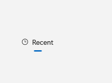

# SelectorBarItem

## Description

SelectorBarItem is a selectable view choice inside SelectorBar. `SelectorBarItem` is shown within `SelectorBar`; it is not a separate gallery destination.

| Light | Dark |
| --- | --- |
|  |  |

## Example usage

```xml
<fluence:SelectorBar SelectedIndex="0">
    <fluence:SelectorBarItem Text="Recent" />
    <fluence:SelectorBarItem Text="Shared" />
</fluence:SelectorBar>
```

## State and behavior

The selected item gets the active indicator and its Text and optional Icon remain visible.

## Reference

- [C# API reference](../api/Fluence.Wpf.Controls/SelectorBarItem.md)
- [Gallery XAML source](../../Fluence.Wpf.Demo/Pages/GalleryNavigationPage.xaml)
- [Gallery C# source](../../Fluence.Wpf.Demo/Pages/GalleryNavigationPage.xaml.cs)
- [Control source](../../Fluence.Wpf/Controls/SelectorBarItem.cs)
- [Control catalog](../controls.md)
