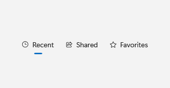

# SelectorBar

## Description

Use SelectorBar to switch between peer views of one page, and SlideNavigationPresenter to slide the view in from the side the selection moved.

| Light | Dark |
| --- | --- |
|  |  |

## Example usage

```xml
<fluence:SelectorBar SelectedIndex="0">
    <fluence:SelectorBarItem Text="Recent" />
    <fluence:SelectorBarItem Text="Shared" />
</fluence:SelectorBar>
```

## State and behavior

Selection changes the active item. Handle `SelectionChanged` or bind `SelectedItem` to update the displayed view; the gallery pairs it with SlideNavigationPresenter.

## Reference

- [C# API reference](../api/Fluence.Wpf.Controls/SelectorBar.md)
- [Gallery XAML source](../../Fluence.Wpf.Demo/Pages/GalleryNavigationPage.xaml)
- [Gallery C# source](../../Fluence.Wpf.Demo/Pages/GalleryNavigationPage.xaml.cs)
- [Control source](../../Fluence.Wpf/Controls/SelectorBar.cs)
- [Control catalog](../controls.md)
