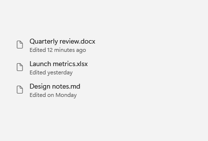
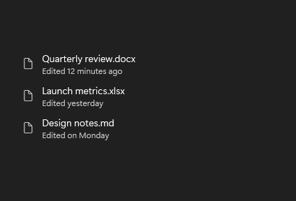

# SlideNavigationPresenter

## Description

SlideNavigationPresenter animates content changes. Set `TransitionEffect` to choose the incoming direction.

Use it when content changes should slide in a direction selected by the caller.

| Light | Dark |
| --- | --- |
|  |  |

## Example usage

```xml
<fluence:SlideNavigationPresenter
    x:Name="SectionHost"
    TransitionEffect="FromRight">
    <TextBlock Text="Current page" />
</fluence:SlideNavigationPresenter>
```

With a page already displayed, set the effect before replacing `Content`. For backward navigation, use `FromLeft`:

```csharp
SectionHost.TransitionEffect = Fluence.Wpf.SlideNavigationTransitionEffect.FromLeft;
SectionHost.Content = new System.Windows.Controls.TextBlock { Text = "Previous view" };
```

## State and behavior

The default is `FromRight`. The control does not infer navigation direction; the caller sets `FromLeft` before a backward change.

## Reference

- [C# API reference](../api/Fluence.Wpf.Controls/SlideNavigationPresenter.md)
- [Gallery XAML source](../../Fluence.Wpf.Demo/Pages/GalleryNavigationPage.xaml)
- [Gallery C# source](../../Fluence.Wpf.Demo/Pages/GalleryNavigationPage.xaml.cs)
- [Control source](../../Fluence.Wpf/Controls/SlideNavigationPresenter.cs)
- [Control catalog](../controls.md)
