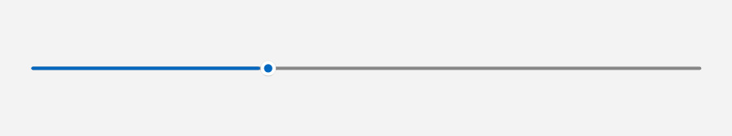

# Slider

## Description

Use sliders when a relative value is easier to choose visually than typing a precise number.

| Light | Dark |
| --- | --- |
|  |  |

## Example usage

```xml
<fluence:Slider Value="35" Minimum="0" Maximum="100" />
```

## State and behavior

Dragging or using the keyboard changes Value; bounds and tick settings constrain the selection.

## Reference

- [C# API reference](../api/Fluence.Wpf.Controls/Slider.md)
- [Gallery XAML source](../../Fluence.Wpf.Demo/Pages/GalleryInputsPage.xaml)
- [Gallery C# source](../../Fluence.Wpf.Demo/Pages/GalleryInputsPage.xaml.cs)
- [Control source](../../Fluence.Wpf/Controls/Slider.cs)
- [Control catalog](../controls.md)
