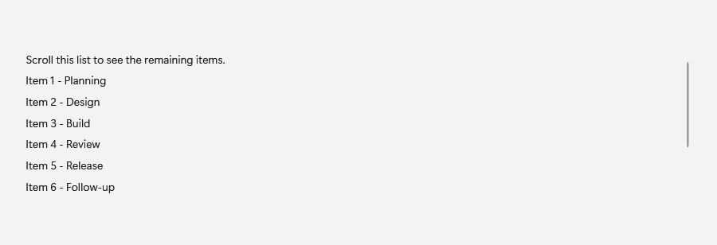
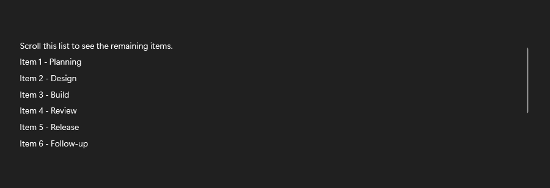
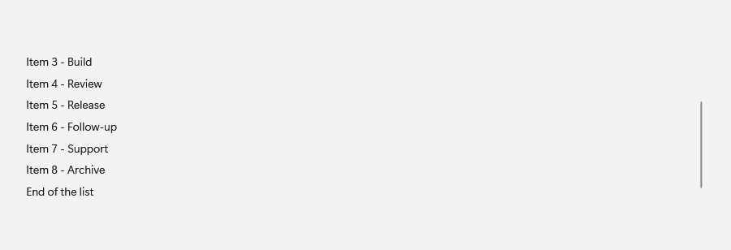
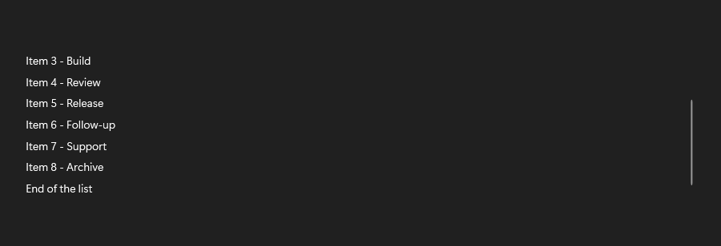

# SmoothScrollViewer

## Description

SmoothScrollViewer hosts content with Fluent scrolling behavior and themed scrollbars.

Use it for scrollable content that should use Fluence scrolling visuals.

| Light | Dark |
| --- | --- |
|  |  |

### After scrolling

The lower items come into view and the scrollbar indicator appears at the right edge.

| Light | Dark |
| --- | --- |
|  |  |

## Example usage

```xml
<fluence:SmoothScrollViewer Height="220">
    <StackPanel Height="500">
        <TextBlock Text="Top of the content" />
        <TextBlock Margin="0,450,0,0" Text="Bottom of the content" />
    </StackPanel>
</fluence:SmoothScrollViewer>
```

## State and behavior

Scrolling changes the viewport while retaining Fluent scrollbar presentation.

## Reference

- [C# API reference](../api/Fluence.Wpf.Controls/SmoothScrollViewer.md)
- [Gallery XAML source](../../Fluence.Wpf.Demo/Pages/GalleryLayoutPage.xaml)
- [Gallery C# source](../../Fluence.Wpf.Demo/Pages/GalleryLayoutPage.xaml.cs)
- [Control source](../../Fluence.Wpf/Controls/SmoothScrollViewer.cs)
- [Control catalog](../controls.md)
