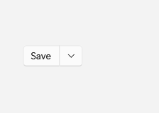

# SplitButton

## Description

Use SplitButton when there is one default action plus alternate actions in the flyout.

| Light | Dark |
| --- | --- |
|  |  |

## Example usage

```xml
<fluence:SplitButton Content="Save" Command="{Binding SaveCommand}">
    <fluence:SplitButton.Flyout>
        <StackPanel>
            <fluence:Button Content="Save as" Command="{Binding SaveAsCommand}" />
            <fluence:Button Content="Export" Command="{Binding ExportCommand}" />
        </StackPanel>
    </fluence:SplitButton.Flyout>
</fluence:SplitButton>
```

The main region invokes `SaveCommand`; bind the alternate commands on the page's data context.

## State and behavior

The main region performs the default action while the arrow opens alternate actions.

## Reference

- [C# API reference](../api/Fluence.Wpf.Controls/SplitButton.md)
- [Gallery XAML source](../../Fluence.Wpf.Demo/Pages/GalleryButtonsPage.xaml)
- [Gallery C# source](../../Fluence.Wpf.Demo/Pages/GalleryButtonsPage.xaml.cs)
- [Control source](../../Fluence.Wpf/Controls/SplitButton.cs)
- [Control catalog](../controls.md)
