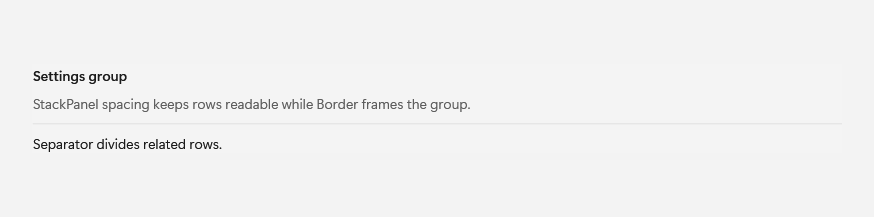
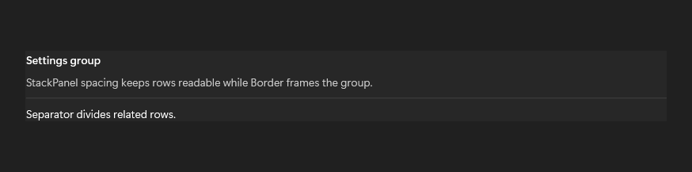

# StackPanel

## Description

Use Border to frame a region, StackPanel spacing for readable rows, and Separator to divide related content.

| Light | Dark |
| --- | --- |
|  |  |

## Example usage

```xml
<fluence:StackPanel Spacing="10">
    <fluence:Button Content="New" />
    <fluence:Button Content="Open" />
    <fluence:Button Content="Save" />
</fluence:StackPanel>
```

## State and behavior

Spacing changes the gaps between stacked children; orientation changes the layout direction.

## Reference

- [C# API reference](../api/Fluence.Wpf.Controls/StackPanel.md)
- [Gallery XAML source](../../Fluence.Wpf.Demo/Pages/GalleryLayoutPage.xaml)
- [Gallery C# source](../../Fluence.Wpf.Demo/Pages/GalleryLayoutPage.xaml.cs)
- [Control source](../../Fluence.Wpf/Controls/StackPanel.cs)
- [Control catalog](../controls.md)
