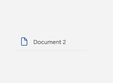
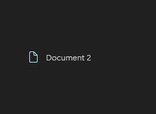

# TabViewItem

## Description

TabViewItem is a document tab inside TabView. `TabViewItem` is shown within `TabView`; it is not a separate gallery destination.

Use it for a document or workspace tab inside TabView.

| Light | Dark |
| --- | --- |
|  |  |

## Example usage

```xml
<fluence:TabView>
    <fluence:TabViewItem Header="Document 1" IsSelected="True" />
    <fluence:TabViewItem Header="Document 2" IsClosable="False" />
</fluence:TabView>
```

## State and behavior

Selected and inactive tabs have different presentations; IsClosable controls the close affordance.

## Reference

- [C# API reference](../api/Fluence.Wpf.Controls/TabViewItem.md)
- [Gallery XAML source](../../Fluence.Wpf.Demo/Pages/GalleryTabsPage.xaml)
- [Gallery C# source](../../Fluence.Wpf.Demo/Pages/GalleryTabsPage.xaml.cs)
- [Control source](../../Fluence.Wpf/Controls/TabViewItem.cs)
- [Control catalog](../controls.md)
