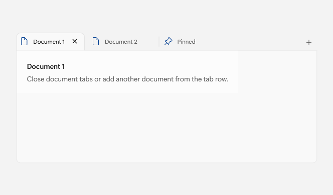
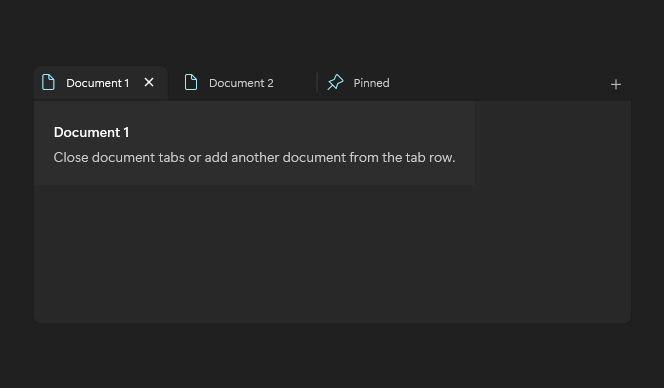

# TabView

## Description

Use TabView for document-style tabs with add and close affordances.

| Light | Dark |
| --- | --- |
|  |  |

## Example usage

```xml
<fluence:TabView>
    <fluence:TabViewItem Header="Document 1" IsSelected="True" />
    <fluence:TabViewItem Header="Document 2" />
</fluence:TabView>
```

## State and behavior

Selection changes the visible document; add and close requests are handled by the application.

## Reference

- [C# API reference](../api/Fluence.Wpf.Controls/TabView.md)
- [Gallery XAML source](../../Fluence.Wpf.Demo/Pages/GalleryTabsPage.xaml)
- [Gallery C# source](../../Fluence.Wpf.Demo/Pages/GalleryTabsPage.xaml.cs)
- [Control source](../../Fluence.Wpf/Controls/TabView.cs)
- [Control catalog](../controls.md)
