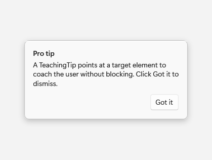
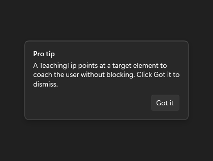

# TeachingTip

## Description

Use TeachingTip for contextual, non-blocking coaching anchored to a UI element.

| Light | Dark |
| --- | --- |
|  |  |

## Example usage

```xml
<Grid>
    <fluence:Button x:Name="TipAnchor" Content="Feature" />
    <fluence:TeachingTip
        Title="Pro tip"
        Subtitle="This feature keeps your recent work close."
        Target="{Binding ElementName=TipAnchor}"
        IsOpen="True"
        CloseButtonContent="Got it" />
</Grid>
```

## State and behavior

IsOpen shows contextual coaching; action or close controls update its open state.

## Reference

- [C# API reference](../api/Fluence.Wpf.Controls/TeachingTip.md)
- [Gallery XAML source](../../Fluence.Wpf.Demo/Pages/GalleryMenusPage.xaml)
- [Gallery C# source](../../Fluence.Wpf.Demo/Pages/GalleryMenusPage.xaml.cs)
- [Control source](../../Fluence.Wpf/Controls/TeachingTip.cs)
- [Control catalog](../controls.md)
