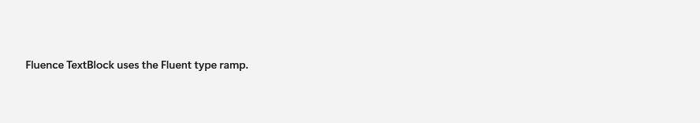

# TextBlockExtensions

## Description

TextBlockExtensions adds Fluent typography and related attached properties to native text. `TextBlockExtensions` is shown within `TextBlock`; it is not a separate gallery destination.

The gallery image shows the typography ramp on a native TextBlock. It does not isolate an attached TextBlockExtensions property.

| Light | Dark |
| --- | --- |
|  |  |

## Example usage

```xml
<TextBlock Text="Section heading"
           fluence:TextBlockExtensions.Typography="Subtitle" />
```

## State and behavior

Attached typography and selection properties change native text presentation.

## Reference

- [C# API reference](../api/Fluence.Wpf.Controls/TextBlockExtensions.md)
- [Gallery XAML source](../../Fluence.Wpf.Demo/Pages/GalleryTypographyPage.xaml)
- [Gallery C# source](../../Fluence.Wpf.Demo/Pages/GalleryTypographyPage.xaml.cs)
- [Control source](../../Fluence.Wpf/Controls/TextBlockExtensions.cs)
- [Control catalog](../controls.md)
