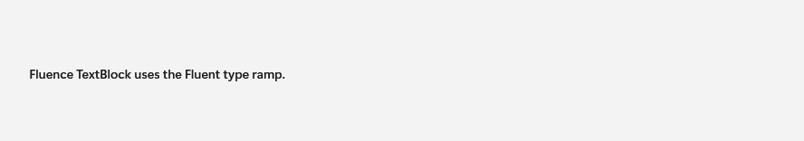

# TextBlock

## Description

Fluence TextBlock presents text using the Fluent typography ramp.

Use it for read-only text that should follow the Fluent typography ramp.

| Light | Dark |
| --- | --- |
|  |  |

## Example usage

```xml
<fluence:TextBlock Text="Section heading" Typography="Subtitle" />
```

## State and behavior

Typography resources change the text style; theme changes update its foreground.

## Reference

- [C# API reference](../api/Fluence.Wpf.Controls/TextBlock.md)
- [Gallery XAML source](../../Fluence.Wpf.Demo/Pages/GalleryTypographyPage.xaml)
- [Gallery C# source](../../Fluence.Wpf.Demo/Pages/GalleryTypographyPage.xaml.cs)
- [Control source](../../Fluence.Wpf/Controls/TextBlock.cs)
- [Control catalog](../controls.md)
