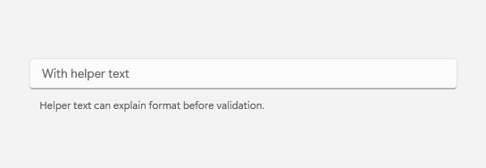
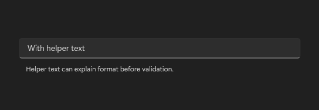
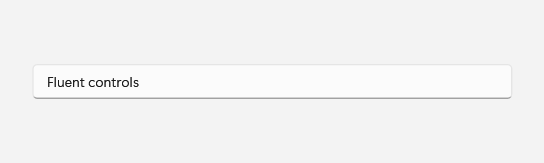
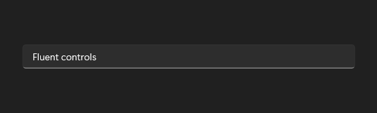

# TextBox

## Description

Show helper text for guidance and validation states for committed feedback.

Use it for text entry with helper text or validation feedback.

| Light | Dark |
| --- | --- |
|  |  |

### Captured state changes

**Text entered**




## Example usage

```xml
<fluence:TextBox PlaceholderText="With helper text" />
```

## State and behavior

Focus, text entry, helper text, and validation states change the field presentation.

## Reference

- [C# API reference](../api/Fluence.Wpf.Controls/TextBox.md)
- [Gallery XAML source](../../Fluence.Wpf.Demo/Pages/GalleryInputsPage.xaml)
- [Gallery C# source](../../Fluence.Wpf.Demo/Pages/GalleryInputsPage.xaml.cs)
- [Control source](../../Fluence.Wpf/Controls/TextBox.cs)
- [Control catalog](../controls.md)
