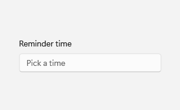
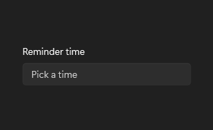

# TimePicker

## Description

Use TimePicker for choosing a time from hour, minute, and AM/PM columns in a flyout.

| Light | Dark |
| --- | --- |
|  |  |

## Example usage

```xml
<fluence:TimePicker Header="Reminder time" PlaceholderText="Pick a time" />
```

## State and behavior

Opening the picker exposes time columns; selection updates the chosen time.

## Reference

- [C# API reference](../api/Fluence.Wpf.Controls/TimePicker.md)
- [Gallery XAML source](../../Fluence.Wpf.Demo/Pages/GalleryFormsPage.xaml)
- [Gallery C# source](../../Fluence.Wpf.Demo/Pages/GalleryFormsPage.xaml.cs)
- [Control source](../../Fluence.Wpf/Controls/TimePicker.cs)
- [Control catalog](../controls.md)
