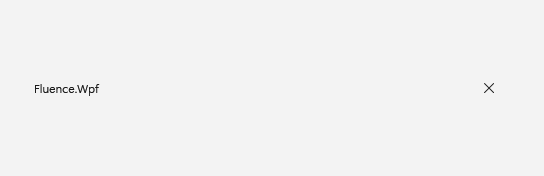
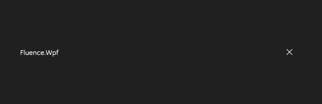

# TitleBar

## Description

`TitleBar` is a Fluence `ContentControl` designed for use in a `FluenceWindow` title-bar region. It renders title metadata, optional back and pane-toggle buttons, header slots, and centered custom content. It does not perform navigation or toggle a navigation pane by itself; connect its command properties or request events to your application behavior.

Use it in a FluenceWindow when the window needs title metadata or application navigation controls.

| Light | Dark |
| --- | --- |
|  |  |

## Example usage

Initialize theme resources before creating the window. If startup code creates the window in `OnStartup`, remove `StartupUri` from `App.xaml`; see [Basic walkthrough](../csharp/usage.md#initialize-the-application).

Set `ExtendsContentIntoTitleBar` on the containing window and assign a `TitleBar` to its `TitleBar` content property. The window's default title-bar height is 48 device-independent units. `TitleBar.IsCompact` selects the 32-unit compact layout.

```xml
<fluence:FluenceWindow x:Class="MyApp.MainWindow"
    xmlns="http://schemas.microsoft.com/winfx/2006/xaml/presentation"
    xmlns:x="http://schemas.microsoft.com/winfx/2006/xaml"
    xmlns:fluence="http://schemas.fluencewpf.com"
    Title="My app"
    ExtendsContentIntoTitleBar="True">
    <fluence:FluenceWindow.TitleBar>
        <fluence:TitleBar Title="My app"
            Subtitle="Workspace"
            IsBackButtonVisible="True"
            IsPaneToggleButtonVisible="True"
            BackRequested="TitleBar_BackRequested"
            PaneToggleRequested="TitleBar_PaneToggleRequested" />
    </fluence:FluenceWindow.TitleBar>
    <fluence:NavigationView x:Name="AppNavigation">
        <fluence:NavigationView.Content>
            <Frame x:Name="MainFrame" />
        </fluence:NavigationView.Content>
    </fluence:NavigationView>
</fluence:FluenceWindow>
```
```csharp
using System;
using System.Windows;
using Fluence.Wpf.Controls;

namespace MyApp;

public partial class MainWindow : FluenceWindow
{
    public MainWindow()
    {
        InitializeComponent();
    }

    private void TitleBar_BackRequested(object? sender, EventArgs e)
    {
        if (MainFrame.CanGoBack)
        {
            MainFrame.GoBack();
        }
    }

    private void TitleBar_PaneToggleRequested(object? sender, EventArgs e)
    {
        AppNavigation.IsPaneOpen = !AppNavigation.IsPaneOpen;
    }
}
```

The XAML declares `MainFrame` inside `AppNavigation`, so the handlers can use the named controls directly. If a request event is used, implement the corresponding application action there. Alternatively, assign `BackCommand` or `PaneToggleCommand` and optional command parameters. A command that cannot execute disables its button; the request event is raised after a command executes successfully, or after a click when no command is assigned.

## State and behavior

| Property or event | Default | Purpose |
| --- | --- | --- |
| `Title`, `Subtitle` | Empty string | Text displayed in the title bar. |
| `Icon` | `null` | Object displayed as the title icon. |
| `IsBackButtonVisible` | `false` | Shows the back button when true. |
| `IsPaneToggleButtonVisible` | `false` | Shows the pane-toggle button when true. |
| `IsCompact` | `false` | Uses a 32-unit title bar instead of the standard 48-unit layout. |
| `LeftHeader`, `RightHeader` | `null` | Content slots to the left and right of the central title-bar area. |
| `CustomContent` | `null` | Content displayed in the centered slot. |
| `BackCommand`, `PaneToggleCommand` | `null` | Commands invoked by their respective buttons. |
| `BackRequested`, `PaneToggleRequested` | Not applicable | Events for handling button requests in code. |

Interactive custom content placed in the extended chrome must set `WindowChrome.IsHitTestVisibleInChrome="True"` so WPF can route pointer input to it. The [gallery title bar](../../Fluence.Wpf.Demo/MainWindow.xaml) demonstrates this on its search control. Keep the title bar's content within the available space beside the caption controls.

## Reference

- [C# API reference](../api/Fluence.Wpf.Controls/TitleBar.md)
- [Gallery XAML source](../../Fluence.Wpf.Demo/MainWindow.xaml)
- [Gallery C# source](../../Fluence.Wpf.Demo/MainWindow.xaml.cs)
- [Control source](../../Fluence.Wpf/Controls/TitleBar.cs)
- [Control catalog](../controls.md)
