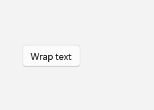
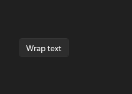

# ToggleButton

## Description

Use ToggleButton when a command switches a state on or off and should look pressed while active.

| Light | Dark |
| --- | --- |
|  |  |

## Example usage

```xml
<fluence:ToggleButton Content="Wrap text" IsChecked="True" />
```

## State and behavior

IsChecked controls the persistent pressed presentation; the gallery also demonstrates unchecked and disabled states.

## Reference

- [C# API reference](../api/Fluence.Wpf.Controls/ToggleButton.md)
- [Gallery XAML source](../../Fluence.Wpf.Demo/Pages/GalleryButtonsPage.xaml)
- [Gallery C# source](../../Fluence.Wpf.Demo/Pages/GalleryButtonsPage.xaml.cs)
- [Control source](../../Fluence.Wpf/Controls/ToggleButton.cs)
- [Control catalog](../controls.md)
