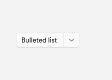
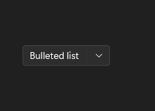

# ToggleSplitButton

## Description

Use ToggleSplitButton when the primary half toggles a state and the flyout chooses which variant of that state to apply.

| Light | Dark |
| --- | --- |
|  |  |

## Example usage

```xml
<fluence:ToggleSplitButton Content="Bulleted list" IsChecked="True">
    <fluence:ToggleSplitButton.Flyout>
        <StackPanel>
            <fluence:Button Content="Bulleted list" Command="{Binding BulletedListCommand}" />
            <fluence:Button Content="Numbered list" Command="{Binding NumberedListCommand}" />
        </StackPanel>
    </fluence:ToggleSplitButton.Flyout>
</fluence:ToggleSplitButton>
```

The main region toggles `IsChecked`; bind the flyout commands on the page's data context to choose a variant.

## State and behavior

The main region changes IsChecked; the arrow opens variants without toggling the current state.

## Reference

- [C# API reference](../api/Fluence.Wpf.Controls/ToggleSplitButton.md)
- [Gallery XAML source](../../Fluence.Wpf.Demo/Pages/GalleryButtonsPage.xaml)
- [Gallery C# source](../../Fluence.Wpf.Demo/Pages/GalleryButtonsPage.xaml.cs)
- [Control source](../../Fluence.Wpf/Controls/ToggleSplitButton.cs)
- [Control catalog](../controls.md)
