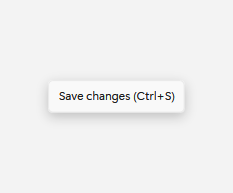
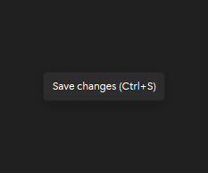

# ToolTip

## Description

Use ToolTip for short hints that clarify icons, disabled commands, or risky actions.

| Light | Dark |
| --- | --- |
|  |  |

## Example usage

```xml
<fluence:Button Content="Save">
    <fluence:Button.ToolTip>
        <fluence:ToolTip Content="Save changes (Ctrl+S)" />
    </fluence:Button.ToolTip>
</fluence:Button>
```

## State and behavior

Hover or keyboard focus reveals a brief hint; it closes when focus or hover ends.

## Reference

- [C# API reference](../api/Fluence.Wpf.Controls/ToolTip.md)
- [Gallery XAML source](../../Fluence.Wpf.Demo/Pages/GalleryMenusPage.xaml)
- [Gallery C# source](../../Fluence.Wpf.Demo/Pages/GalleryMenusPage.xaml.cs)
- [Control source](../../Fluence.Wpf/Controls/ToolTip.cs)
- [Control catalog](../controls.md)
