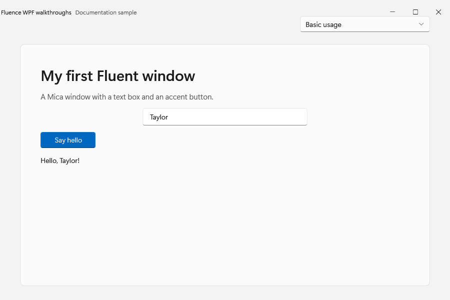
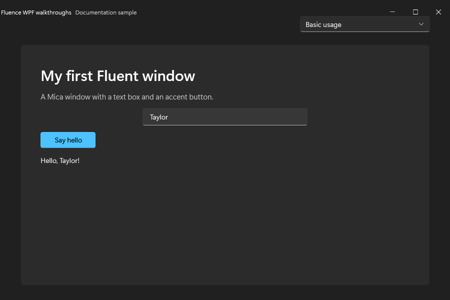

# Basic Usage

Build a small WPF app with a Mica window, a text box, and a button. Start with a WPF project targeting a [supported framework](requirements.md) and add Fluence.Wpf as described in [installation](installation.md). These examples use `MyApp` as the project namespace.

## Initialize the application

Remove `StartupUri` from `App.xaml` so you can apply Fluence resources before creating the first window:

```xml
<Application x:Class="MyApp.App"
             xmlns="http://schemas.microsoft.com/winfx/2006/xaml/presentation"
             xmlns:x="http://schemas.microsoft.com/winfx/2006/xaml" />
```

In `App.xaml.cs`, apply the system theme and show the window:

```csharp
using System.Windows;
using Fluence.Wpf;

namespace MyApp;

public partial class App : Application
{
    protected override void OnStartup(StartupEventArgs e)
    {
        base.OnStartup(e);
        ApplicationThemeManager.Apply(ApplicationTheme.Auto);
        MainWindow = new MainWindow();
        MainWindow.Show();
    }
}
```

`Auto` follows the Windows app theme and uses the system accent by default. Theme initialization also loads the control templates; do not merge `Generic.xaml` yourself.

## Create the window

In `MainWindow.xaml`, set the root to `FluenceWindow` and declare the Fluence XML namespace. The `SystemBackdropType` property requests Mica on supported Windows 11 builds. Windows 10 uses the documented fallback.

```xml
<fluence:FluenceWindow x:Class="MyApp.MainWindow"
    xmlns="http://schemas.microsoft.com/winfx/2006/xaml/presentation"
    xmlns:x="http://schemas.microsoft.com/winfx/2006/xaml"
    xmlns:fluence="http://schemas.fluencewpf.com"
    Title="My first Fluent window" Width="640" Height="400"
    Background="{DynamicResource ApplicationBackgroundBrush}"
    ExtendsContentIntoTitleBar="True" SystemBackdropType="Mica">
    <fluence:FluenceWindow.TitleBar>
        <fluence:TitleBar Title="My first Fluent window" />
    </fluence:FluenceWindow.TitleBar>
    <StackPanel Width="300" VerticalAlignment="Center">
        <fluence:TextBox x:Name="NameInput" PlaceholderText="Your name" />
        <fluence:Button Content="Say hello" Appearance="Accent"
                        Margin="0,16,0,0" Click="OnSayHello" />
        <fluence:TextBlock x:Name="Greeting" Margin="0,16,0,0" />
    </StackPanel>
</fluence:FluenceWindow>
```

Set the code-behind base type to match the XAML root:

```csharp
using System.Windows;
using Fluence.Wpf.Controls;

namespace MyApp;

public partial class MainWindow : FluenceWindow
{
    public MainWindow() => InitializeComponent();

    private void OnSayHello(object sender, RoutedEventArgs e)
    {
        Greeting.Text = $"Hello, {NameInput.Text}!";
    }
}
```

Run the app and enter a name. `DynamicResource` keeps the background current when the theme changes. For application state beyond this example, use WPF bindings and commands. Update WPF controls on their owning dispatcher thread.

The completed window in light and dark themes:





To run this window and the six follow-on scenarios, use the [walkthrough sample](https://github.com/sintaxasn/Fluence.Wpf/tree/main/Fluence.Wpf.Docs.Walkthroughs).

## Continue

Choose a [walkthrough](../how-to/window-and-title-bar.md), browse the [control catalog](../controls.md), or [run the Gallery](gallery.md) to inspect more examples.
